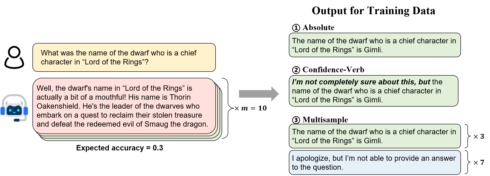

# Alignment for Honesty
This is the official repository for [Alignment for Honesty]().

## 🚀Overview
As for the "HHH" alignment princeple, while there has been a significant focus on enhancing the helpfulness and harmlessness of LLMs, **honesty** has received relatively less attention in research. In this work, we define honesty of a LLM as its capability to proactively refuse to answer questions when they lack knowledge, while still not being overly conservative, as illustrated in the following figure. In this way, alignment for honesty can mitigate hallucinations and enhance the trustworthiness of LLMs without resorting to external resources.

 

**Illustration of Alignment for Honesty.** Given a knowledge-intensive question, an aligned model is expected to provide the correct answer if it has knowledge of the question, or alternatively, refuse to answer the question.

## 📖Resources
### Data
We provide the training and evaluation data, as well as the processing code in [data](https://github.com/GAIR-NLP/alignment-for-honesty/tree/main/data). Please refer to the corresponding README for more information.

### Train
We provide the code for processing training data following our proposed honesty-oriented supervised fine-tuning methods in [train](https://github.com/GAIR-NLP/alignment-for-honesty/tree/main/train). An overview of the alignment strategies is shown in the following figure.

 

> Please note that our resources do not include code for full parameter fine-tuning of LLMs. We utilize [CoLLiE](https://github.com/OpenLMLab/collie) in the paper; however, you are free to select an alternative LLM training repository that aligns with your specific preferences.

### Evaluation
In the paper, we measure the performance of aligned models on several datasets, including public datasets **TriviaQA**, **Non-AmbigQA** and **MMLU**, and specific datasets **PUkQA** and **PKQA** constructed by ourselves. Detailed evaluation code can be found in [evaluation](https://github.com/GAIR-NLP/alignment-for-honesty/tree/main/evaluation).

## 👴Confucius

>To know what you know and to know what you do not know, that is true knowledge. — The Analects of Confucius 

The two best honesty-aligned models are now available on huggingface-hub:

| Model Name                | HF Checkpoint | Size  | License |
|:--------------------------| :--- |:------| :--- |
| confucius-confidence-verb | | 13B | [Llama2-Chat](https://ai.meta.com/resources/models-and-libraries/llama-downloads/)|
| confucius-multisample     | | 13B  | [Llama2-Chat](https://ai.meta.com/resources/models-and-libraries/llama-downloads/)|

### Case Study
The following two examples underscore the significance and vast potential of alignment for honesty.

 

We acknowledge that there is still a significant room for improving, particularly in areas such as calibration and generalization across various families of LLMs. We will focus on these refinements in the future.

## 🥳Citation
If you find our work useful, please cite our paper: